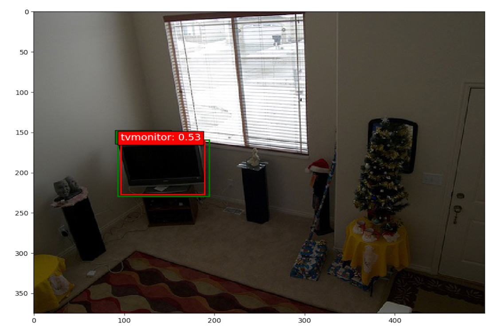

## SSD: Single-Shot MultiBox Detector implementation in Keras
Original attempt: https://github.com/shpach/SSD-Experiments
---
### Contents

1. [Overview](#overview)
2. [Training Details](#training-details)
3. [Directory Structure](#directory-structure)
4. [Experiments](#experiments)
5. [Performance](#performance)
6. [Training on Google Cloud](#training-on-google-cloud)
7. [Video Tracking](#video-tracking)
8. [Examples](#examples)
9. [Acknowledgments](#acknowledgments)


### Overview

This is a Keras port of the SSD model architecture introduced by Wei Liu et al. in the paper [SSD: Single Shot MultiBox Detector](https://arxiv.org/abs/1512.02325). We implement and extend the ideas presented in the original SSD paper and apply it to real-time object detection in videos.

### Training details

To train the original SSD300 model on Pascal VOC:

1. Download the datasets:
  ```c
  wget http://host.robots.ox.ac.uk/pascal/VOC/voc2012/VOCtrainval_11-May-2012.tar
  wget http://host.robots.ox.ac.uk/pascal/VOC/voc2007/VOCtrainval_06-Nov-2007.tar
  wget http://host.robots.ox.ac.uk/pascal/VOC/voc2007/VOCtest_06-Nov-2007.tar
  ```
2. Download the weights for the convolutionalized VGG-16 or for one of the trained original models provided below.
3. Set the file paths for the datasets and model weights accordingly in [`ssd300_training.ipynb`](ssd300_training.ipynb) and execute the cells.

### Directory Structure

```bash
.
├── LICENSE.txt
├── README.md
├── __init__.py
├── bounding_box_utils
│   ├── __init__.py
│   └── bounding_box_utils.py
├── data
│   ├── VGG_ILSVRC_16_layers_fc_reduced.h5
│   ├── VOC2007
│   │   ├── test
│   │   │   ├── Annotations
│   │   │   ├── ImageSets
│   │   │   ├── JPEGImages
│   │   │   ├── SegmentationClass
│   │   │   └── SegmentationObject
│   │   └── train
│   │       ├── Annotations
│   │       ├── ImageSets
│   │       ├── JPEGImages
│   │       ├── SegmentationClass
│   │       └── SegmentationObject
│   ├── VOCtrainval_06-Nov-2007.tar
│   └── VOCtrainval_11-May-2012.tar
├── data_generator
│   ├── __init__.py
│   ├── data_augmentation_chain_constant_input_size.py
│   ├── data_augmentation_chain_original_ssd.py
│   ├── data_augmentation_chain_satellite.py
│   ├── data_augmentation_chain_variable_input_size.py
│   ├── object_detection_2d_data_generator.py
│   ├── object_detection_2d_geometric_ops.py
│   ├── object_detection_2d_image_boxes_validation_utils.py
│   ├── object_detection_2d_misc_utils.py
│   ├── object_detection_2d_patch_sampling_ops.py
│   └── object_detection_2d_photometric_ops.py
├── eval_utils
│   ├── __init__.py
│   ├── average_precision_evaluator.py
│   └── coco_utils.py
├── keras_layers
│   ├── __init__.py
│   ├── keras_layer_AnchorBoxes.py
│   ├── keras_layer_DecodeDetections.py
│   ├── keras_layer_DecodeDetectionsFast.py
│   └── keras_layer_L2Normalization.py
├── keras_loss_function
│   ├── __init__.py
│   └── keras_ssd_loss.py
├── misc_utils
│   ├── __init__.py
│   └── tensor_sampling_utils.py
├── model.h5
├── models
│   ├── __init__.py
│   └── keras_ssd300.py
├── ssd300_evaluation.ipynb
├── ssd300_evaluation_COCO.ipynb
├── ssd300_inference.ipynb
├── ssd300_pascal_07+12_training_log.csv
├── ssd300_training.ipynb
├── ssd_encoder_decoder
│   ├── __init__.py
│   ├── matching_utils.py
│   ├── ssd_input_encoder.py
│   └── ssd_output_decoder.py
├── train_ssd.py
└── training_summaries
    ├── ssd300_pascal_07+12_loss_history.png
    └── ssd300_pascal_07+12_training_summary.md
```

### Experiments

We ran three major experiments.

#### VGG19 SSD

We replace the VGG16 base network from authors’ implementation with a VGG19 network. By using a more complex model, we expect to gain more representational power and thus better image classification. We keep the same multiscale feature maps except for conv4_3 of VGG16, which we replace with conv4_4 from VGG19. We also want to tweak the weights in the base network to better suit the problem of object detection, so we fine-tune these weights with a learning rate of 0.001 using Adam.

#### InceptionResNetV2 SSD

This is the same idea as VGG19 SSD, except we replace the base network with InceptionResNetV2. Since the model is much more complex than VGG19, we freeze the weights to avoid the complexity of training so many parameters. 

#### Modernized SSD

For our last major experiment, we went back to the VGG19 base network, but this time we added batch normalization layers in between the convolutional layers of the SSD specific network. On top of this, we added more aspect ratios combinations for the default boxes. Specifically, for every prediction layer, we had the aspect ratios: {1, 2, 1/2, 3, 1/3}. The original model only had these aspect ratios for the middle three layers. For the upper two feature maps that are used in the classifier, we added aspect ratios 4 and 1/4.

### Performance

Following is a brief summary of the training comparisons of different models we tried. Our model with InceptionResNetV2 overfits aggressively, whereas the other two models are quite close to the original SSD in terms of training and validation loss. We provide the mAP evaluations for our best model, which we call "Modernized SSD", on the VOC2007 `test` dataset.

<table width="70%">
  <tr>
    <td></td>
    <td colspan=1 align=center>Mean Average Precision</td>
    <td colspan=1 align=center>Training Loss</td>
    <td colspan=1 align=center>Validation Loss</td>
  </tr>
  <tr>
    <td>Evaluated on</td>
    <td colspan=2 align=center>VOC2007 test</td>
  </tr>
  <tr>
    <td><b>Original SSD</td>
    <td align=center><b>0.738</td>
    <td align=center><b>3.9</td>
    <td align=center><b>4.6</td>
  </tr>
  <tr>
    <td><b>VGG19 SSD</td>
    <td align=center><b>N/A</td>
    <td align=center><b>5.09</td>
    <td align=center><b>5.13</td>
  </tr>
  <tr>
    <td><b>InceptionResNetV2 SSD</td>
    <td align=center><b>N/A</td> 
    <td align=center><b>5.07</td>
    <td align=center><b>83.36</td>
  </tr>
  <tr>
    <td><b>Modernized SSD</td>
    <td align=center><b>0.52</td>
    <td align=center><b>4.72</td>
    <td align=center><b>4.76</td> 
  </tr>
</table>


### Encoding and decoding boxes

The [`ssd_encoder_decoder`](ssd_encoder_decoder) sub-package contains all functions and classes related to encoding and decoding boxes. Encoding boxes means converting ground truth labels into the target format that the loss function needs during training. It is this encoding process in which the matching of ground truth boxes to anchor boxes (the paper calls them default boxes and in the original C++ code they are called priors - all the same thing) happens. Decoding boxes means converting raw model output back to the input label format, which entails various conversion and filtering processes such as non-maximum suppression (NMS).

In order to train the model, you need to create an instance of `SSDInputEncoder` that needs to be passed to the data generator. The data generator does the rest, so you don't usually need to call any of `SSDInputEncoder`'s methods manually.

Models can be created in 'training' or 'inference' mode. In 'training' mode, the model outputs the raw prediction tensor that still needs to be post-processed with coordinate conversion, confidence thresholding, non-maximum suppression, etc. The functions `decode_detections()` and `decode_detections_fast()` are responsible for that. The former follows the original Caffe implementation, which entails performing NMS per object class, while the latter performs NMS globally across all object classes and is thus more efficient, but also behaves slightly differently. Read the documentation for details about both functions. If a model is created in 'inference' mode, its last layer is the `DecodeDetections` layer, which performs all the post-processing that `decode_detections()` does, but in TensorFlow. That means the output of the model is already the post-processed output. In order to be trainable, a model must be created in 'training' mode. The trained weights can then later be loaded into a model that was created in 'inference' mode.

A note on the anchor box offset coordinates used internally by the model: This may or may not be obvious to you, but it is important to understand that it is not possible for the model to predict absolute coordinates for the predicted bounding boxes. In order to be able to predict absolute box coordinates, the convolutional layers responsible for localization would need to produce different output values for the same object instance at different locations within the input image. This isn't possible of course: For a given input to the filter of a convolutional layer, the filter will produce the same output regardless of the spatial position within the image because of the shared weights. This is the reason why the model predicts offsets to anchor boxes instead of absolute coordinates, and why during training, absolute ground truth coordinates are converted to anchor box offsets in the encoding process. The fact that the model predicts offsets to anchor box coordinates is in turn the reason why the model contains anchor box layers that do nothing but output the anchor box coordinates so that the model's output tensor can include those. If the model's output tensor did not contain the anchor box coordinates, the information to convert the predicted offsets back to absolute coordinates would be missing in the model output.

### Training on Google Cloud
If you want to train on Google Cloud, you will need to port over this entire codebase to a Google Cloud bucket, as well as the training and validation data. Then, edit the training scripts to point to where your datasets exist. To actually run the job, you will have to provide the [`train_ssd.py`](train_ssd.py) script to the ML Engine. You also need to specify the path to your GPU config (we have given ours in this repository). Specifically, if you were in the parent directory to this repository. You could run:
```bash
gcloud ml-engine jobs submit training model1_job --module-name=ssd_keras.train_ssd --package-path=./ssd_keras --job-dir=gs://deeplearningteam11/logs --config=./ssd_keras/cloudml-gpu.yaml --python-version 3.5 --runtime-version 1.10 --region us-east1
```

If you wanted to resume training an existing model, you will need to change the range of epochs in which you will train the model in [`train_existing.py`](train_existing.py). Then, from the parent directory to this repository, you could run:
```bash
gcloud ml-engine jobs submit training resume_model1_job --module-name=ssd_keras.train_existing --package-path=./ssd_keras --job-dir=gs://deeplearningteam11/logs --config=./ssd_keras/cloudml-gpu.yaml --python-version 3.5 --runtime-version 1.10 --region us-east1
```

### Video Tracking

In the video application, we use Kernel Correlation Filters between the frames to smoothen the output, avoid missing and overlap detections, etc. Our algorithm achieves two things, it performs a smoother object tracking for videos and it stores an object image with an ID to the local server. Please visit https://www.youtube.com/watch?v=UvZ9-yo7Xgg&feature=youtu.be to see our tracking algorithm in action.


### Examples

Below are some prediction examples of the fully trained Modernized SSD300 model (i.e. trained on Pascal VOC2007 `trainval`). The predictions were made on Pascal VOC2007 `test`.

| | |
|---|---|
|  |  |
<!-- |  |  | -->

Following are some snapshots from our video tracking example.

| | |
|---|---|
|  |  |
<!-- |  |  | -->

### Acknowledgments

We thank Professor Iddo Drori and Chenqin Xu for their guidance, as well as funding our research. We also thank Wei Liu for his original contributions to creating the SSD architecture.
